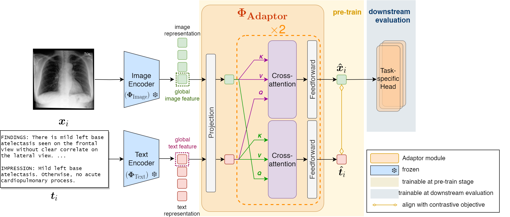

# Freeze the backbones: A Parameter-Efficient Contrastive Approach to Robust Medical Vision-Language Pre-training
MSc Artificial Intelligence Thesis. [[pdf](https://drive.google.com/file/d/1Pd9hOVO5FebXm87JE0yqdUaCcZbVSOO5/view?usp=sharing)] 

We present the Adaptor framework, a **parameter-efficient Vision-language Self-Supervised Learning method for enhanced medical vision representation learning**. The Adaptor framework freezes pre-trained dual encoders and employs a backbone-agnostic module with cross-attention for intermodality fusion. This approach is computationally efficient, preserves the depth of medical knowledge from each individual encoder and synergises them to curate enriched, general-purpose medical features.


<!-- ## Code Structure

```
adaptor
├── MGCA/...   # We use MGCA https://github.com/HKU-MedAI/MGCA for data preprocessing etc
├── dataset/
│   ├── configurations.py    # dataset configurations
│   ├── data_module.py    # LightningDataModule
│   └── dataset.py    # pytorch classes for pre-train and downstream task datasets
├── models/
│   ├── adaptor.py    # Adaptor model
│   ├── configurations.py    # configs associated with backbone models
│   ├── finetuner.py    # End-to-end classification pipeline
│   ├── seg_models.py    # Segmentation encoder-decoder
│   └── segmenter.py    # End-to-end segmentation pipeline
├── notebooks/...    # jupyter notebooks that generates tables and figures in report
├── shell/   # shell scripts that runs experiments on doc slurm GPU cluster  
│   ├── finetune-covidx.sh
│   ├── finetune-rsna.sh
│   ├── get_pretrained_embeddings.sh
│   ├── pretrain.sh
│   ├── segment-rsna.sh
│   └── segment-siim.sh
├── utils/
│   ├── args.py    #                                        Training argument parser
│   ├── dataset_utils.py    # Util functions for datasets
│   ├── model_utils.py    # Util functions for models
│   └── utils.py    # Other util functions
├── get_pretrained_embeddings.py    # get uni-modal embeddings from pre-train dataset
├── pretrain.py    # run pre-train from uni-modal embeddings
├── finetune.py    # run downstream classification tuning
├── segment.py    # run downstream segmetation tuning
├── requirements.txt    # Required packages  
└── README.md
``` -->

## Install required packages

```
pip install -r requirements.txt
```

## Data preparation
We use [MGCA](https://github.com/HKU-MedAI/MGCA) code at this stage. 

### Dataset downloading
Datasets we used are as follows:

- MIMIC-CXR: We downloaded the [MIMIC-CXR-JPG](https://physionet.org/content/mimic-cxr-jpg/2.0.0/) dataset as the radiographs. Paired medical reports can be downloaded in [MIMIC-CXR](https://physionet.org/content/mimic-cxr/2.0.0/mimic-cxr-reports.zip).

- RSNA: We used the stage 2 of RSNA dataset in [Kaggle](https://www.kaggle.com/competitions/rsna-pneumonia-detection-challenge/data).

- COVIDx: We used the version 5 of COVIDx dataset in [Kaggle](https://www.kaggle.com/datasets/andyczhao/covidx-cxr2). Compatible labels are found in the [COVID-Net](https://github.com/lindawangg/COVID-Net/tree/master/labels) repository. 

- SIIM: We downloaded the stage 1 of SIIM dataset in [Kaggle](https://www.kaggle.com/competitions/siim-acr-pneumothorax-segmentation/data).

After downloading datasets, please check if the path in `MGCA/mgca/constants.py` is correct.
 
### Data Preprocessing
We preprocessed these datasets and split the dataset into train/val/test set using the code in `MGCA/mgca/preprocess`.

```
cd MGCA
python mgca/preprocess/mimic_cxr.py
python mgca/preprocess/rsna.py
python mgca/preprocess/covidx.py
python mgca/preprocess/siim.py
```


## Pre-train
### Get uni-modal embeddings
```
export $N_GPUS=2
export $VISION_MODEL="resnet-ae"  # choose from resnet-ae, dinov2-s, dinov2-b
export $TEXT_MODEL="bert"  # choose from bert, biobert, pubmedbert, cxrbert, clinicalbert
python3 -m torch.distributed.launch --nproc_per_node N_GPUS get_pretrained_embeddings.py --vision_model VISION_MODEL --force_rebuild_dataset
python3 -m torch.distributed.launch --nproc_per_node N_GPUS get_pretrained_embeddings.py --text_model TEXT_MODEL --force_rebuild_dataset
```
### Run pre-training
Run pre-training for specific vision and text dual encoder:
```
export VISION_MODEL="dinov2-s"
export TEXT_MODEL="biobert"

python ./pretrain.py \
    --vision_model $VISION_MODEL \
    --text_model $TEXT_MODEL \
    --batch_size 1024 \ 
    --data_pct 1.0 \
    --num_workers 4 \
    --num_train_epochs 50 \
    --seed 42 \
    --lr 2e-5 \
    --output_dir $SAVED_MODEL_DIR/${VISION_MODEL}_${TEXT_MODEL}/adaptor_pretrain
```

Run pre-training for all combinations of implemented encoders:  
```
export SAVED_MODEL_DIR="./trained_models/pretrain"
for VISION_MODEL in "dinov2-b" "resnet-ae" "dinov2-s"
do
    for TEXT_MODEL in  "biobert" "clinicalbert" "cxrbert" "pubmedbert" "bert"
    do
        python ./pretrain.py \
            --vision_model $VISION_MODEL \
            --text_model $TEXT_MODEL \
            --batch_size 1024 \ 
            --data_pct 1.0 \
            --num_workers 4 \
            --num_train_epochs 50 \
            --seed 42 \
            --lr 2e-5 \
            --output_dir $SAVED_MODEL_DIR/${VISION_MODEL}_${TEXT_MODEL}/adaptor_pretrain
    done
done
```
## Downstream task 
### Medical Image Classification
```
export SAVED_MODEL_DIR="./trained_models/clf"
export VISION_MODEL="resnet-ae"
export TEXT_MODEL="bert"

export DATASET="rsna"
python ./finetune.py \
    --dataset $DATASET \ 
    --vision_model $VISION_MODEL \
    --text_model $TEXT_MODEL \
    --batch_size 512 \
    --data_pct 1.0 \
    --num_train_epochs 100 \
    --output_dir $SAVED_MODEL_DIR/${VISION_MODEL}_${TEXT_MODEL}_${DATASET}

export DATASET="rsna"
python ./finetune.py \
    --dataset $DATASET \ 
    --vision_model $VISION_MODEL \
    --text_model $TEXT_MODEL \
    --batch_size 512 \
    --weight_decay 0.05 \
    --data_pct 1.0 \
    --num_train_epochs 100 \
    --output_dir $SAVED_MODEL_DIR/${VISION_MODEL}_${TEXT_MODEL}_${DATASET}
```
### Medical Image Segmentation
```
export SAVED_MODEL_DIR="./trained_models/segment"
export VISION_MODEL="resnet-ae"
export TEXT_MODEL="bert"

export DATASET="siim"
python ./segment.py \
    --dataset $DATASET \
    --crop_size 896 \
    --vision_model $VISION_MODEL \
    --text_model $TEXT_MODEL \
    --batch_size 4 \
    --data_pct 1.0 \ 
    --num_train_epochs 100 \
    --output_dir $SAVED_MODEL_DIR/${VISION_MODEL}_${TEXT_MODEL}_${DATASET} 

export DATASET="rsna"
python ./segment.py \
    --dataset $DATASET \
    --crop_size 224 \
    --vision_model $VISION_MODEL \
    --text_model $TEXT_MODEL \
    --batch_size 4 \
    --data_pct 1.0 \ 
    --num_train_epochs 100 \
    --output_dir $SAVED_MODEL_DIR/${VISION_MODEL}_${TEXT_MODEL}_${DATASET} 
```
